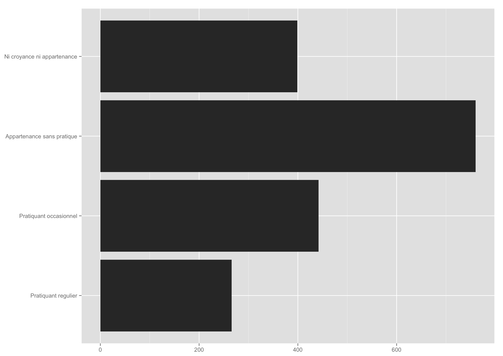
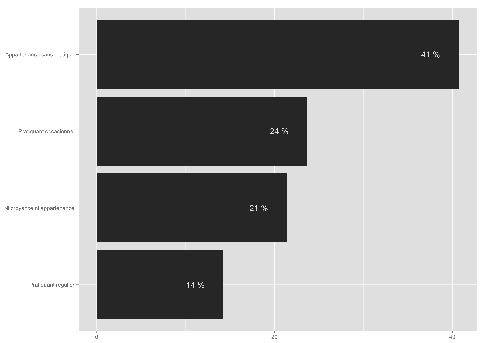
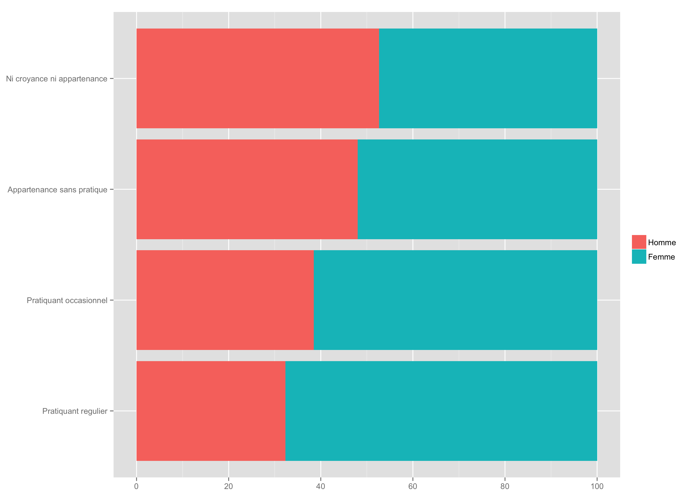
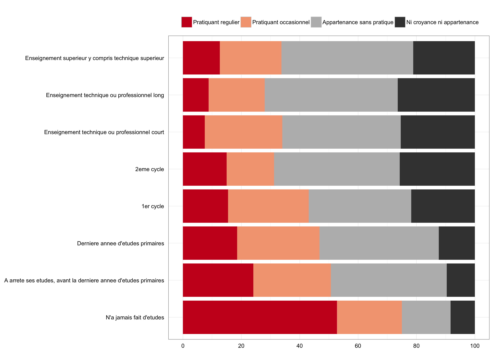

# ggtable: simple frequencies and tabulations as bar plots

__ggtable__ is a wrapper for a family of bar plots that are commonly used with low-dimensional variables from [questionnaire][4dpc] or survey data. Such variables will use a low number of response items, generally as nominal categories or ordered scales. The bar plots for their fequencies will consist of horizontal bars or stacked bars, using raw counts or percentages.

__See also__ the `vcd` package, the [`likert`][likert] package for more advanced plots with scaled response items, or [Marrimekko plots][ds] to plot proportions in nested categorical data. These are more advanced solutions, while `ggtable` is just a convenience wrapper to quickly get bar plots out of categorical or ordinal data.

[4dpc]: http://4dpiecharts.com/2010/09/25/visualising-questionnaires/
[likert]: http://jason.bryer.org/likert/
[ds]: http://is-r.tumblr.com/post/33290921643/simple-marimekko-mosaic-plots

The examples below use data bundled and prepared with the `questionr` package:

    require(devtools)
    install_github("questionr", "briatte")
    require(questionr)
    data(hdv2003)

The variables are from a French national survey conducted in 2003:

    # Religiosity.
    freq(x <- recode.na(hdv2003$relig, "NSP ou NVPR|Rejet"))
    # Gender.
    freq(y <- hdv2003$sexe)

## One-way examples

    # Simple one-way bars.
    ggtable(x)

    # Suppress ordering.
    ggtable(x, order = FALSE)

    # Percentages and labels.
    ggtable(x, percent = TRUE, label = TRUE, append = " %")

## Two-way examples

    # Religiosity by sex.
    ggtable(x, y)

    # Stacked bars.
    ggtable(x, y, percent = TRUE)

    # Manual reorder of y.
    ggtable(y, x, order.y = c("Homme", "Femme"))

## Options and theming

    # With many options.
    ggtable(y, x, order.y = c("Homme", "Femme"), horizontal = FALSE, percent = TRUE, position = "dodge", legend.position = "bottom")

    # With theme settings.
    ggtable(hdv2003$nivetud, x, percent = TRUE, palette = "RdGy") + 
      theme_bw(12) +
      theme(legend.position = "top", axis.ticks = element_blank())

